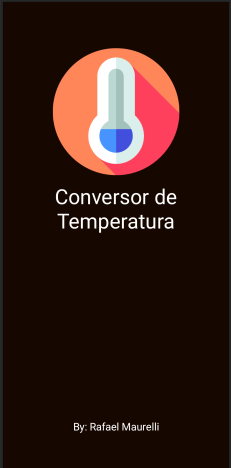
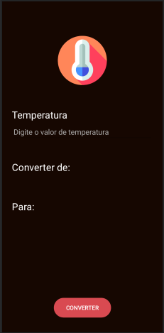
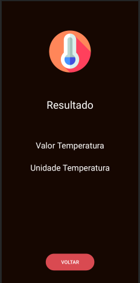

# Temp_Converter

 Aplicativo para converção de valores de temperatura nas unidades de medida Fahrenheit, Celsius e Kelvin. 

 Este aplicativo foi um dos desafios realizados durante o curso de Kotlin Estação Hack - Cel.Lep. 

### Tela de Splash do aplicativo

### Tela Main do aplicativo

### Tela de Resultado do aplicativo

